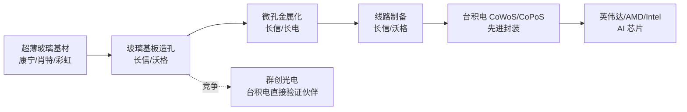

# TGV玻璃基板

## 定义
TGV（Through Glass Via，玻璃通孔）是在超薄玻璃基板上打孔并金属化填充，形成垂直电气互连的先进封装基板技术。相比传统有机 ABF 基板和硅中介层，TGV 在**翘曲控制、大尺寸、成本、供电**四方面具备结构性优势，是 AI 芯片先进封装的核心卡位技术。

## 关键数据
- **2026/6 台积电 CoWoS 玻璃基板开发计划**：锁定 Ibiden（ABF 龙头）+ 群创光电（玻璃基材）联合验证
- **关键数据**：翘曲改善 16%、供电改善 27%（[来源：WebSearch 百家号 1868318170, 🟢real]）
- **2026/6/21 台积电启动 CoPoS（面板级封装）**：用 Glass Core 替代有机芯板
- **长信科技进度**：造孔/金属化/线路三大技术已通，中试线在建，已送样头部客户 [来源：wenda-news 格隆汇 5247503, 🟢real]
- **行业判断**：TGV 整体仍处中试→小批量阶段，2026 末小批量、2027 规模化放量

## 产业链位置（mermaid）

## 关键标的

| 代码 | 简称 | 进度 | 评级 | 来源 |
|------|------|------|------|------|
| 603773 | 沃格光电 | 玻璃基 1.6T 光模块/CPO 小批量送样，**与英伟达协同** | 龙头 | WebSearch 1863494874 |
| 600584 | 长电科技 | TGV 射频 IPD 技术突破 | 强 | WebSearch 1866206024 |
| **300088** | **长信科技** | **TGV 中试送样、3 大技术已通** | **跟跑** | **wenda-news 格隆汇** |
| 600707 | 彩虹股份 | 明确"**没有相关产品进入半导体封装领域**" | 退出 | WebSearch 1863494874 |
| 002475 | 兴森科技 | 仅样品研发 | 弱 | WebSearch guba 1729328508 |
| 688310 | 美迪凯 | 仅样品研发 | 弱 | WebSearch guba 1729328508 |

## 长信科技 TGV 进度（深度）
- 2025 末：**申请第一件 TGV 通孔蚀刻专利**（起步晚）[来源：WebSearch 1864042715]
- 2026/5-6：投资者互动平台确认**造孔工艺开发完成、微孔金属化完成、玻璃线路制备能力**
- 2026/6/8：中试线搭建中，**已给多个客户送样、评测结果理想** [来源：wenda-news 5247503]
- 2026 末：计划小批量
- 2027：规模化放量

## 预期差指标

| 维度 | 评估 |
|------|------|
| 产业链认知 | 80%（媒体广泛报道，但技术细节被高估）|
| 行业实际进度 | 30%（仅 1-2 家送样阶段）|
| 资本市场预期 | 95%（已 Price In）|
| 预期差 | **5-10% 偏多**（利好已透支）|

## 相关节点
- [[玻璃基板]]
- [[CoPoS面板级封装]]
- [[群创光电]]
- [[沃格光电_603773]]
- [[长信科技_300088]]
- [[台积电供应链]]
- [[AI算力]]

## 风险
- TGV 量产延期（设备到位率、良率、产线稼动率均不明确）
- 沃格/长电抢占订单（沃格与英伟达已有真实协同）
- 群创直接与台积电验证，绕过长信（二阶风险）
- 玻璃基板整体 Price In 80%+，新增催化稀缺
