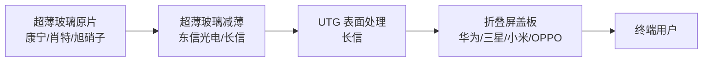

# UTG超薄玻璃

## 定义
UTG（Ultra-Thin Glass，超薄柔性玻璃）是厚度 30-100μm 的柔性玻璃基材，用于折叠屏盖板、CPI 替代、光学元件等场景。具备高透光率、低色偏、抗划伤、可弯折次数超 20 万次等核心优势。

## 关键数据
- **长信科技旗下东信光电**：30μm UTG 全流程量产，**良率约 85%** [来源：WebSearch 东财 1867613134, 🟢real]
- **成本优势**：较日韩低 15-18% [同上]
- **核心客户**：华为 [同上]
- **海外对比**：康宁/肖特/旭硝子（传统盖板玻璃厂）

## 长信科技 UTG 进度
| 阶段 | 状态 |
|------|------|
| 量产 | ✅ 30μm 全流程 |
| 良率 | 85%（行业领先）|
| 成本 | 较日韩 -15-18% |
| 客户 | 华为（核心）+ 折叠屏 OEM |
| 营收贡献 | 已计入消费电子业务（2025 年报未单独披露）|
| 行业地位 | **国内 UTG 龙头**（领先沃格/彩虹）|

## 产业链位置

## 关键标的
| 代码 | 简称 | UTG 进度 | 评级 |
|------|------|---------|------|
| **300088** | **长信科技** | **量产+良率 85%+华为客户** | **龙头** |
| 002475 | 蓝思科技 | UTG 玻璃盖板（后段加工）| 强 |
| 000725 | 京东方A | UTG 折叠屏（与长信协同）| 强 |
| 600707 | 彩虹股份 | **无 UTG 量产** | 退出 |

## 与玻璃基板/TGV 关系
- **UTG 是长信科技真强项**（4/27 对比文章确认）
- **TGV 是相对弱项**（2025 末第一件专利）
- **UTG 业务已贡献业绩**（TGV 还在送样阶段）

## 相关节点
- [[TGV玻璃基板]]
- [[玻璃基板]]
- [[折叠屏]]
- [[长信科技_300088]]
- [[华为]]
- [[车载显示]]

## 风险
- 折叠屏手机出货量增长不及预期
- 海外厂商（康宁/肖特）技术升级
- 华为单一客户依赖度高
