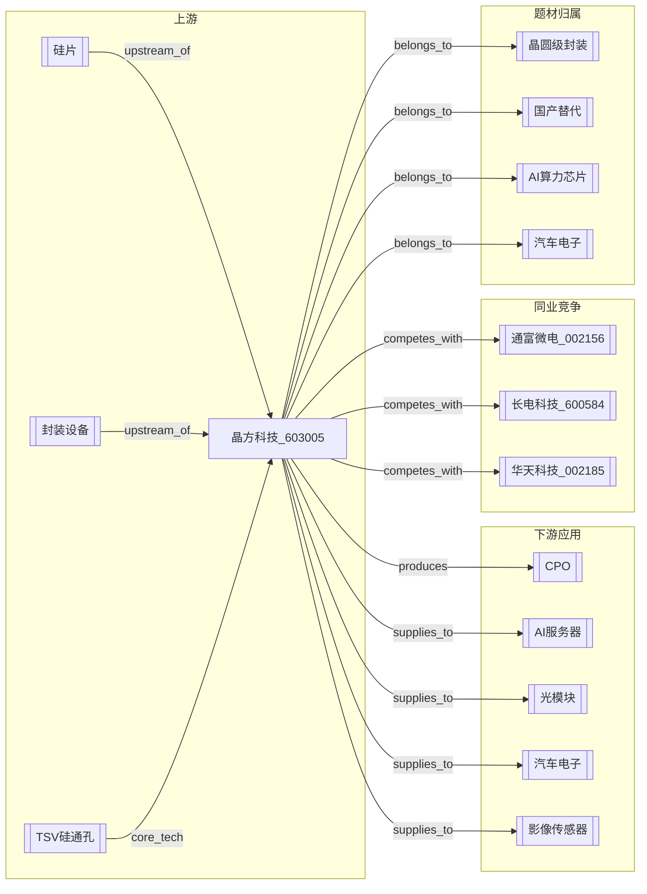

# 晶方科技 603005

> **定位**：晶圆级封装（WLCSP）龙头｜TSV 硅通孔技术｜CPO 光电共封装核心标的｜ carrière 起家于影像传感器封装，向汽车电子/AI 算力延伸

## 公司基本面

- **代码**：603005.SH
- **行业**：半导体 — 封装测试
- **上市**：2014-02-10
- **总市值**：约 200-300 亿（动态，需 Tushare 实时）
- **PE**：较高（封装环节估值溢价）
- **2026Q1**：营收/净利待 Tushare 确认

## 核心业务

1. **晶圆级封装（WLCSP）**（基本盘）
   - 影像传感器封装起家，全球 WLCSP 领先
   - 技术壁垒：TSV 硅通孔、Bumping、RDL 重布线
2. **汽车电子封装**（增量）
   - 车载 CIS、LiDAR 封装
   - 汽车电子认证周期长，壁垒高
3. **CPO / 光电共封装**（核心预期差）
   - CPO（Co-Packaged Optics）将光引擎与交换芯片封装在一起
   - 晶方科技具备 TSV 和光学封装技术储备
   - **预期差**：CPO 产业化进度、订单落地时间、客户验证进展
4. **AI 算力相关封装**（远期）
   - HBM 封装、Chiplet 先进封装布局

## 关联节点

### 上游
- [[硅片]]（晶圆材料）
- [[封装设备]]（光刻机、键合机、测试机）
- [[TSV硅通孔]]（核心技术）

### 下游（应用）
- [[CPO]]（光电共封装，核心增量叙事）
- [[AI服务器]]（CPO 应用主场景）
- [[光模块]]（CPO 替代传统光模块路径）
- [[汽车电子]]（车载 CIS、LiDAR）
- [[影像传感器]]（手机 CIS，基本盘）

### 同业
- [[通富微电_002156]]（OSAT 龙头，AMD 封测）
- [[长电科技_600584]]（全球第三 OSAT）
- [[华天科技_002185]]（天水华天，封测）

### 题材
- [[CPO]]（核心预期差：CPO 产业化进度）
- [[晶圆级封装]]（技术壁垒）
- [[国产替代]]（封装设备/材料国产替代）
- [[AI算力芯片]]（Chiplet/HBM 封装需求）
- [[汽车电子]]（车载封装增量）

## 预期差指标

| 维度 | 预期差 | 验证状态 | 关键验证时点 |
|------|--------|---------|------------|
| 新增订单 | CPO 订单/客户验证 | 未验证 | 2026H2 客户验证结果 |
| 技术突破 | TSV/光学封装良率提升 | 未验证 | 技术公告/客户认证 |
| 稀缺性 | WLCSP + CPO 双技术储备 | 部分验证 | 行业调研 |
| 估值模式 | 从传统封装→CPO 光学封装估值切换 | 未发生 | 订单落地后 |
| 底部反转 | 2025 业绩低点→2026 恢复 | 观察中 | 2026Q2-Q3 财报 |
| 新业务 | CPO 封装业务占比提升 | 未验证 | 2026H2-2027 |

## 风险

- 🔴 CPO 产业化进度低于预期（核心风险）
- 🔴 传统封装业务竞争加剧，毛利率下滑
- 🔴 大客户依赖（单一客户占比高）
- 🟡 估值偏高，需业绩兑现支撑
- 🟡 海外客户验证周期长

## 关联报告

- `D:\stock\晶方科技_603005.md`（v5.6.7-pricein 深度分析）

## 关联操作

- IMA 已上传 ✅
- 待办：CPO 订单/客户验证跟踪
- 待办：2026Q2 财报验证

## 引用记录

- [[晶方科技_603005]] (2026-06-21 深度报告)

---

## 关系图谱（Mermaid）

> **图例**：`-- upstream_of -->` 上游依赖 / `-- produces -->` 生产产品 / `-- supplies_to -->` 供应下游 / `-- competes_with -->` 同业竞争 / `-- belongs_to -->` 题材归属 / `-- core_tech -->` 核心技术

---

## 双向索引快速查询

| 查询方向 | 操作 | 示例 |
|---------|------|------|
| 从概念找标的 | `[[CPO]]` → Incoming | 找到所有CPO相关公司 |
| 从事件找催化 | `[[2026H2 CPO订单]]` → catalyzed_by | 找到被催化的标的 |
| 从上游找标的 | `[[硅片]]` → downstream_of | 找到所有硅片下游公司 |
| 从同业找对标 | `[[通富微电_002156]]` → competes_with | 找到所有竞争对手 |
