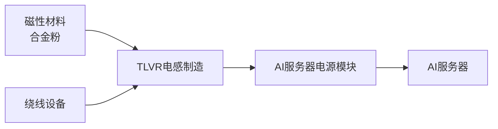

# TLVR电感

> Transient Voltage Regulator 电感，AI服务器多相电源核心部件，2020年顺络布局，2026年量产

## 技术背景

AI服务器GPU功耗飙升至1000W+，传统VRM（电压调节模块）无法满足瞬态响应需求。TLVR通过耦合电感技术实现：
- 更快的瞬态响应（< 1μs）
- 更高的相数（16-32相 vs 传统8-12相）
- 更小的体积（集成化设计）

## 产业链位置

## 关键标的

| 公司 | 代码 | 进展 |
|------|------|------|
| [[顺络电子_002138]] | 002138 | 2020布局，2026已批量供应 |
| [[麦捷科技_300319]] | 300319 | 已供应，涨停异动 |
| Meggitt | 海外 | 国际龙头 |

## 市场空间

| 维度 | 数值 |
|------|------|
| 单机用量 | 8-16颗 |
| 单价 | $5-10/颗 |
| 单机价值量 | $50-100 |
| 2026E AI服务器出货 | 200万台+ |
| 2026E 市场空间 | $1-2亿 |

## 相关节点

- [[电感]]（父节点）
- [[AI服务器]]（应用端）
- [[顺络电子_002138]]（核心标的）

## 预期差

- 市场尚未充分认知TLVR是AI服务器"标配"新增量
- 顺络2020年布局=领先麦捷2-3年
- 单机价值量$50-100 vs 传统电感$5-10 = 10倍增量
