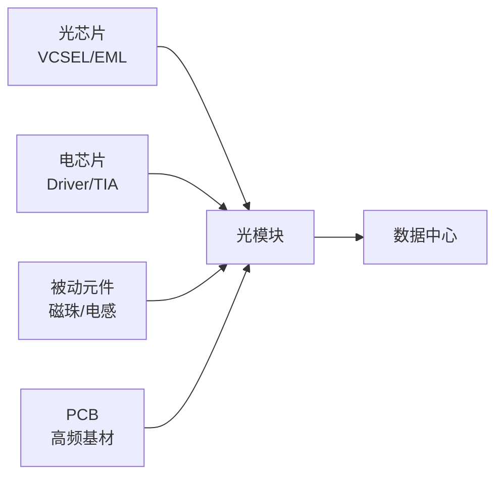

# 光模块

> 数据中心光互连核心，800G/1.6T光模块需求爆发，顺络高频磁珠/功率电感可用于光模块

## 产业链位置



## 顺络在光模块中的角色

| 产品 | 用途 | 状态 |
|------|------|------|
| 高频通信磁珠 | 信号滤波 | 已供应 |
| 大电流磁珠 | 电源滤波 | 已供应 |
| 功率电感 | 电源管理 | 已供应 |

## 关键标的

| 环节 | 公司 | 代码 |
|------|------|------|
| 光模块 | [[中际旭创_300308]] | 300308 |
| 光模块 | [[新易盛_300502]] | 300502 |
| 磁珠/电感 | [[顺络电子_002138]] | 002138 |

## 相关节点

- [[电感]]
- [[AI服务器]]
- [[数据中心]]

## 预期差

- 光模块电感价值量$5-10/只，单数据中心1000+只
- 顺络从"服务器电感"扩展到"光模块电感"=市场扩容2x

---

## 芯片基座/壳体（v2.0 合并内容）

> 高速光模块（800G/1.6T/3.2T）中用于固定芯片、散热的精密结构件。来源：铜铬铌合金材料（斯瑞新材）。

### 技术壁垒

- **等级**: 中高
- **核心要求**: 低热膨胀系数 + 高导热性能
- **材料路线**: 钨铜（主流）→ 钼铜 → 铜金刚石（下一代）
- **下一代**: 铜金刚石（散热性能更优，成本待降）

### 市场容量

| 年份 | 规模 | 来源 |
|------|------|------|
| 2025 | 10-20亿元（全行业） | 估算 |
| 2028 | 50-80亿元 | AI算力需求爆发 |

**增长驱动**: AI算力中心建设 → 800G/1.6T光模块快速渗透

### 竞争格局（芯片基座/壳体）

| 企业 | 代码 | 角色 | 验证级别 | 关键数据 |
|------|------|------|---------|---------|
| [[company/斯瑞新材_688102|斯瑞新材]] | 688102.SH | 芯片基座/壳体（钨铜为主） | ⭐⭐⭐⭐⭐ | 2025年收入7380.80万，同比+208.29% |

### 客户结构

| 客户 | 性质 | 验证来源 |
|------|------|---------|
| 环球广电（AOI子公司） | 北美光模块厂商 | e互动确认 ⭐⭐⭐⭐⭐ |
| 剑桥科技 | 光模块 | e互动确认 ⭐⭐⭐⭐⭐ |
| 索尔思 | 光模块 | e互动确认 ⭐⭐⭐⭐⭐ |
| 菲尼萨 | 光模块 | e互动确认 ⭐⭐⭐⭐⭐ |
| 东莞讯滔 | 光模块 | e互动确认 ⭐⭐⭐⭐⭐ |
| 天孚通信 | A股光模块核心供应商 | e互动确认 ⭐⭐⭐⭐⭐ |

**关键洞察**: 已进入AOI海外供应链，间接绑定北美光模块需求。

### 技术路线演进

```
钨铜（当前主流）
  → 钼铜（斯瑞新材正在开发，轻量化+低膨胀）
    → 铜金刚石（散热性能最优，成本待降，1.6T+储备）
```

**关键变量**: 铜金刚石低成本制备工艺突破 → 1.6T以上光模块规模化应用

*内容合并：v2.0 optical_module_chip_base.md ─ 2026-06-20*
