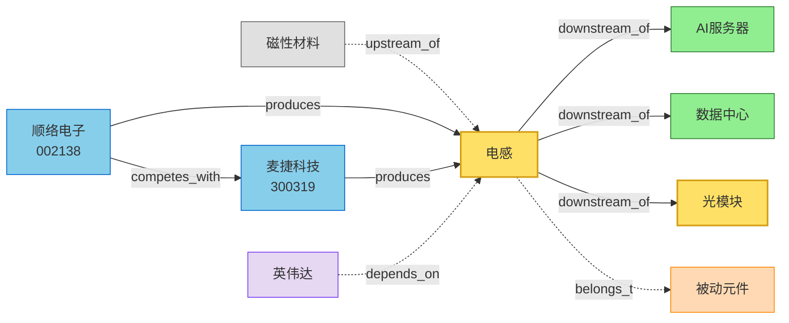

# 电感

> 被动元件三大类之一（电阻/电容/电感），用于电路中的能量存储、滤波、阻抗匹配

## 节点类型
`component` / `passive_element` / 物理

## 抽象层级
2 - 中间层（行业/细分赛道）

## 分类

```
电感
├── 功率电感：电源管理（AI 服务器电源）
├── TLVR电感：服务器多相电源（AI 服务器核心增量）
├── 高频磁珠：信号滤波（光模块）
├── 大电流磁珠：电源滤波（AI 服务器）
└── 共模电感：EMI 抑制（通用）
```

## Outgoing（从本节点出发）

| 关系 | 目标 | 说明 |
|------|------|------|
| `downstream_of` | [[AI服务器]] | 主要应用 |
| `downstream_of` | [[数据中心]] | 次要应用 |
| `downstream_of` | [[光模块]] | 信号滤波 |
| `belongs_to` | [[被动元件]] | 元件分类 |

## Incoming（指向本节点）

| 关系 | 来源 | 说明 |
|------|------|------|
| `produces` | [[顺络电子_002138]] | 主营产品（龙头） |
| `produces` | [[麦捷科技_300319]] | TLVR 电感供应商 |
| `upstream_of` | [[磁性材料]] | 铁氧体/合金粉 → 电感 |
| `depends_on` | [[英伟达_美股]] | GPU 供电链需要大量电感 |

## 关键标的

| 公司 | 代码 | 关系 | 市场地位 |
|------|------|------|---------|
| [[顺络电子_002138]] | 002138 | `produces` | 国内电感龙头，TLVR 量产 |
| [[麦捷科技_300319]] | 300319 | `competes_with` | TLVR 电感供应商 |
| [[风华高科_000636]] | 000636 | `competes_with` | 被动元件龙头（电阻为主）|
| [[铂科新材_300811]] | 300811 | `competes_with` | 金属软磁电感 |

## 产业链位置



## 预期差指标

| 指标 | 当前 | 预期 | 差距 |
|------|------|------|------|
| TLVR电感单价 | 1x | 5-10x | **5-10 倍溢价** |
| AI 服务器单机用量 | 1x | 3-5x | **3-5 倍用量** |
| 数据中心电感市场 CAGR | - | 30%+ | 高增长 |

## 引用记录（被提及于）

| 文档 | 类型 | 提及次数 |
|------|------|---------|
| [[顺络电子_002138]] | 报告 | 12 |

## 相关节点

- [[TLVR电感]]  -- `upstream_of`（子类）
- [[AI服务器]] -- `downstream_of`
- [[钽电容]] -- `sibling_of`（同属被动元件）
- [[光模块]] -- `downstream_of`
- [[被动元件]] -- `belongs_to`
- [[英伟达_美股]] -- `depends_on`（海外映射）

## 历史版本

- 2026-06-19 v1.0：初版，作为 Ontology 1.0 打样节点
- 2026-06-19 v0.5：v5.4 typed relations 升级版