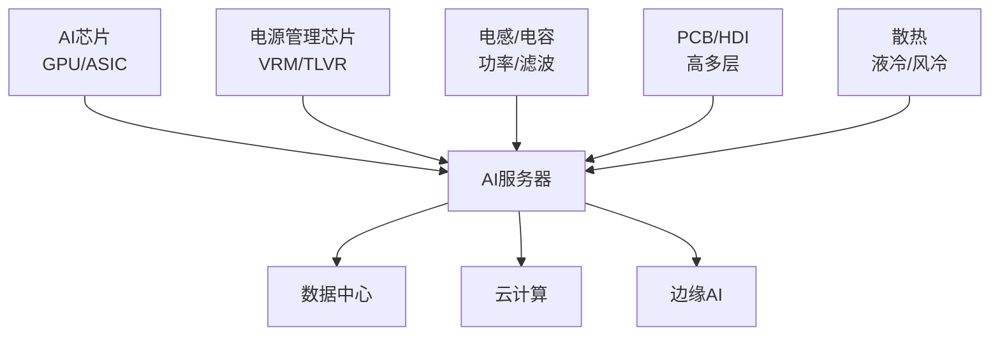

# AI服务器

> AI训练/推理专用服务器，单机功耗从1KW提升至10KW+，电源管理需求爆发

## 产业链位置

## AI服务器 vs 传统服务器（电感需求对比）

| 部件 | 传统服务器 | AI服务器 | 增量倍数 |
|------|----------|---------|---------|
| TLVR电感 | 0 | 8-16颗 | **新增** |
| 功率电感 | 10-15颗 | 30-50颗 | 3x |
| 磁珠 | 50-80颗 | 150-200颗 | 3x |
| 钽电容 | 5-10颗 | 20-40颗 | 4x |

## 关键标的

| 公司 | 代码 | 市场地位 |
|------|------|---------|
| [[通富微电_002156]] | 002156 | （自动追加，待补充） |
| 公司 | 代码 | 市场地位 |
|------|------|---------|
| [[利通电子_603629]] | 603629 | （自动追加，待补充） |
| 环节 | 公司 | 代码 |
|------|------|------|
| TLVR电感 | [[顺络电子_002138]] | 002138 |
| TLVR电感 | [[麦捷科技_300319]] | 300319 |
| 钽电容 | [[顺络电子_002138]] | 002138 |
| 电源芯片 | [[杰华特_688141]] | 688328 |
| PCB | [[兴森科技_002436]] | 002436 |
| PCB | [[景旺电子_603228]] | 603228 |

## 相关节点

- [[电感]]
- [[TLVR电感]]
- [[钽电容]]
- [[数据中心]]
- [[英伟达_美股]]

## 预期差指标

- 全球AI服务器出货量增速（2026E +50% YoY）
- 单机TLVR电感价值量（$50-100/台）
- 顺络/麦捷在AI服务器电感的市占率
