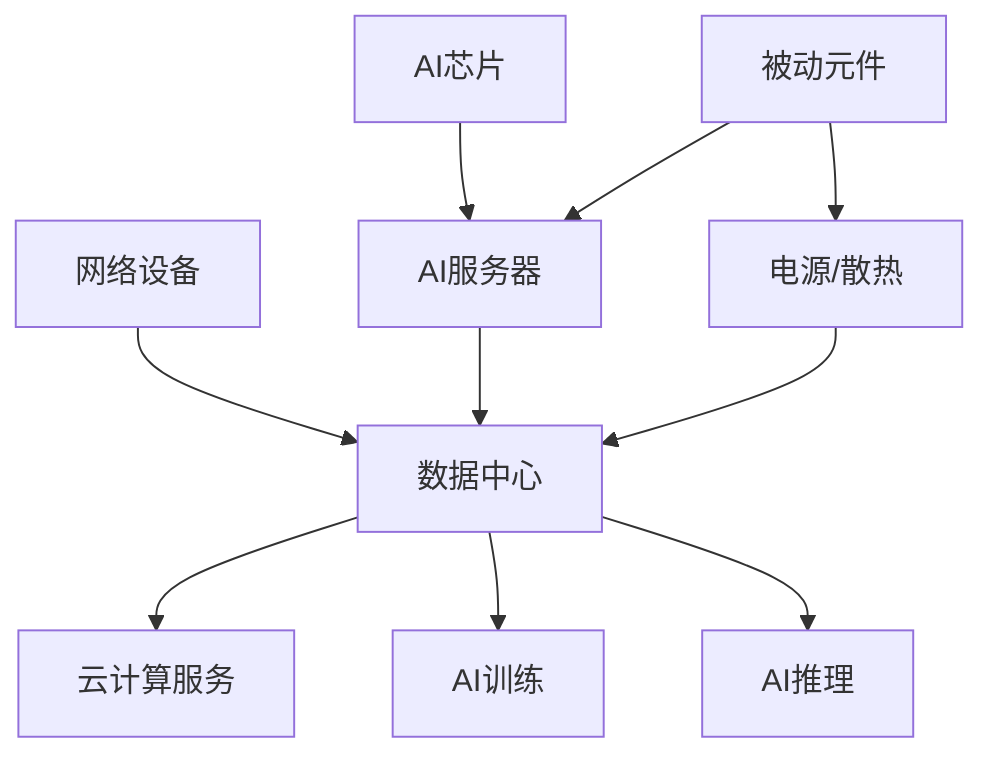

# 数据中心

> AI算力基础设施，2026年全球资本开支超2000亿美元，电感/电容/PCB需求爆发

## 产业链位置

## 顺络在数据中心的角色

| 业务 | 2026Q1占比 | 增长趋势 |
|------|----------|---------|
| AI服务器电感 | <5% | 快速增长 |
| 光模块电感 | 未披露 | 新增量 |
| 数据中心整体 | <5% | 起步阶段 |

## 关键标的（数据中心供应链）

| 环节 | 公司 | 代码 |
|------|------|------|
| 服务器电感 | [[顺络电子_002138]] | 002138 |
| 服务器电源 | [[麦格米特_002851]] | 002851 |
| PCB | [[兴森科技_002436]] | 002436 |
| 光模块 | [[中际旭创_300308]] | 300308 |
| 散热 | [[英维克_002837]] | 002837 |

## 相关节点

- [[AI服务器]]
- [[光模块]]
- [[电感]]

## 预期差

- 顺络数据中心业务Q1<5%=市场尚未充分定价
- 2026E占比有望达10-15%=2-3倍增长空间
- "故事"向"业绩"转化的关键观察点
