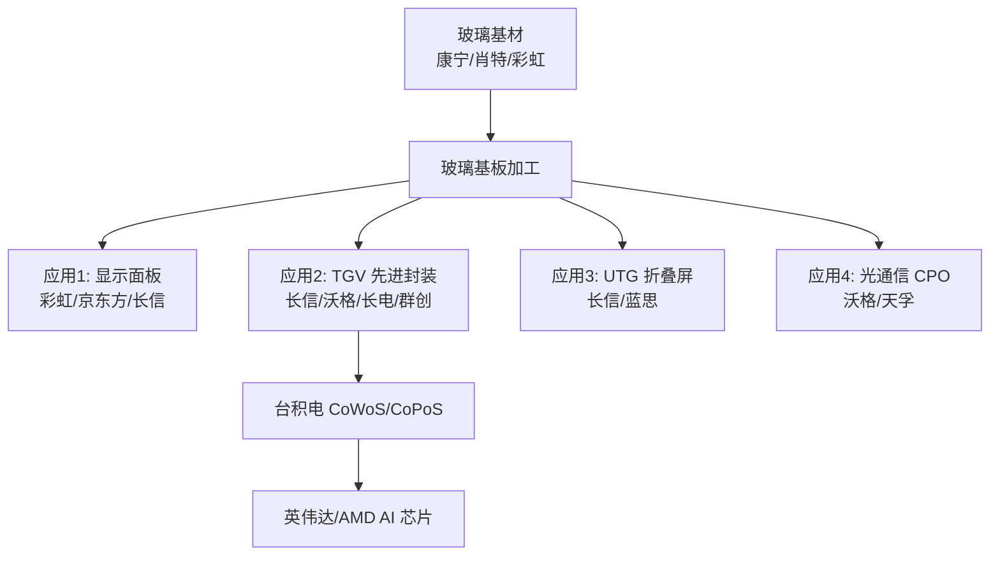

# 玻璃基板

## 定义
玻璃基板是以超薄玻璃为基材的电子封装基板，应用于：
1. **半导体先进封装**（TGV 玻璃通孔，AI 芯片封装）
2. **显示面板**（液晶/OLED 基板）
3. **折叠屏盖板**（UTG 超薄玻璃）
4. **光通信**（玻璃基 1.6T 光模块/CPO）

## 行业关键事件
- **2026/6/16**：台积电 CoWoS 玻璃基板开发计划发布，**翘曲改善 16%、供电改善 27%** [来源：WebSearch 百家号 1868318170, 🟢real]
- **2026/6/21**：台积电启动 CoPoS 面板级封装（用 Glass Core 替代有机芯板）[来源：WebSearch IT之家, 🟢real]
- **2026/4/27**：行业对比文章——彩虹明确"无半导体封装产品"、沃格与英伟达协同、长信 TGV 起步晚 [来源：WebSearch 东方财富 1864042715, 🟢real]

## 产业链位置

## 关键标的对比（v5.2 评级体系）

| 代码 | 简称 | 主业 | 行业地位 | 评级 | 题材强度 | 来源 |
|------|------|------|---------|------|---------|------|
| 603773 | 沃格光电 | 玻璃基 1.6T 光模块/CPO | **TGV 真正龙头**（英伟达协同）| 龙头 | 9.0 | WebSearch 1863494874 |
| 600584 | 长电科技 | 封测+TGV 射频 IPD | TGV 强 | 强 | 8.5 | WebSearch 1866206024 |
| **300088** | **长信科技** | **触控显示+UTG+TGV+智算** | **UTG 龙头，TGV 跟跑** | **跟跑** | **9.0** | **本报告** |
| 600707 | 彩虹股份 | 基板玻璃（液晶面板）| **明确无半导体封装** | 退出 | 6.0 | WebSearch 1863494874 |
| 002475 | 蓝思科技 | UTG 玻璃盖板 | UTG 强 | 强 | 7.0 | WebSearch |
| 600552 | 凯盛科技 | 玻璃基材 | 弱 | 弱 | 5.0 | WebSearch |
| 000725 | 京东方A | 显示龙头 | 显示强 | 强 | 7.5 | - |

## 长信科技在玻璃基板赛道的真实位置
- **UTG（折叠屏）**：✅ 龙头（30μm 量产、良率 85%、华为客户）
- **TGV（半导体封装）**：⚠️ 跟跑（2025 末第一件专利、中试送样）
- **智算（跨界）**：🟡 第二曲线（30 亿投资 + 联通订单）
- **车载显示**：✅ 强（已贡献业绩）

**关键结论**：长信在玻璃基板赛道是"**UTG 龙头 + TGV 跟跑**"的复合定位，**题材强度被市场夸大**（真实 TGV 龙头是沃格）。

## 相关节点
- [[TGV玻璃基板]]
- [[UTG超薄玻璃]]
- [[CoPoS面板级封装]]
- [[沃格光电_603773]]
- [[长信科技_300088]]
- [[彩虹股份_600707]]
- [[长电科技_600584]]
- [[群创光电]]
- [[台积电供应链]]
- [[AI算力]]

## 风险
- 玻璃基板整体 Price In 80%+（截至 2026/6/22）
- TGV 量产延期（行业整体仍处中试阶段）
- 沃格/长电抢占 TGV 订单
- 显示主业承压（2025 净利润 -42.94%）
